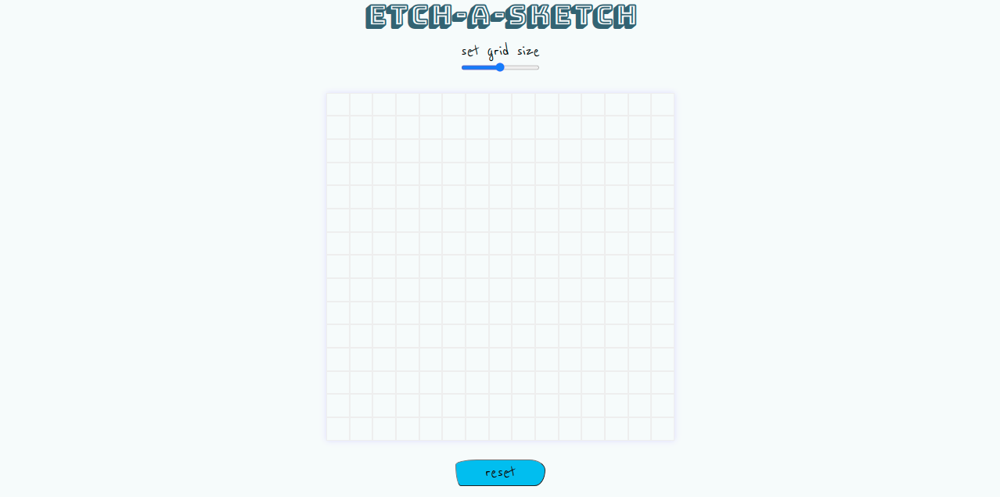

# The Odin Project - Etch-a-Sketch Project

This is a solution to the [etch-a-sketch project in The Odin Project's Foundations curriculum](https://www.theodinproject.com/lessons/foundations-etch-a-sketch).

## Table of contents

- [The Odin Project - Etch-a-Sketch Project](#the-odin-project---etch-a-sketch-project)
  - [Table of contents](#table-of-contents)
  - [Overview](#overview)
    - [The challenge](#the-challenge)
    - [Screenshot](#screenshot)
    - [Links](#links)
  - [My process](#my-process)
    - [Built with](#built-with)
    - [What I learned](#what-i-learned)
    - [Continued development](#continued-development)
  - [Author](#author)

## Overview

### The challenge

Students will build a browser version of something between a sketchpad and an etch-a-sketch. The application should be able to:

- Create a grid of squares
- Create a "hover" effect so that the grid squares change color when the user's mouse passes over them
- Allow the user to change the number of squares in the grid
- **Bonus**: Have each pass through with the mouse change it to a completely random RGB value. Then each subsequent pass darkens the square by 10% so that after 10 passes the square is completely black.

### Screenshot

### Links

- Solution URL: [https://github.com/superschooler/etch-a-sketch](https://github.com/superschooler/etch-a-sketch)
- Live Site URL: [https://superschooler.github.io/etch-a-sketch/](https://superschooler.github.io/etch-a-sketch/)

## My process

### Built with

- Semantic HTML5 markup
- CSS custom properties
- Flexbox
- CSS Grid
- Mobile-first workflow

### What I learned

This project was a great learning experience for me and challenged me in different ways than previous projects I've completed. I enjoyed the practice with the DOM and got to put `js querySelector All ` and `js forEach ` into practice to change each box individually, which I enjoyed learning.

Additionally, the function to darken each cell on subsequent passes allowed me to practice using `js slice() ` and challenged me to evaluate for different string lengths when RGB values fell into double digits. With more time, I think I could have made the transition to black squares a bit more smooth, but I'm happy with my outcome.

I found the random color generating function to be fairly easy and used an HSL value to keep the saturation and lightness values the same on the initial pass so the squares looked uniform.

The HTML & CSS were easy for me to implement.

### Continued development

I look forward to continuing my experience with the DOM and working on the calculator project next. I'm excited to dive into it and am sure I'll continue to learn a lot about JavaScript while also challenging my logic.

## Author

- Website - [Brian Schooler](https://www.brianschooler.com)
- Frontend Mentor - [@superschooler](https://www.frontendmentor.io/profile/superschooler)
- Twitter - [@superschooler](https://www.twitter.com/yourusername)- Website - [Brian Schooler](https://www.brianschooler.com)
- Frontend Mentor - [@superschooler](https://www.frontendmentor.io/profile/superschooler)
- Twitter - [@superschooler](https://twitter.com/SuperSchooler)
- GitHub - [@superschooler](https://github.com/superschooler)
